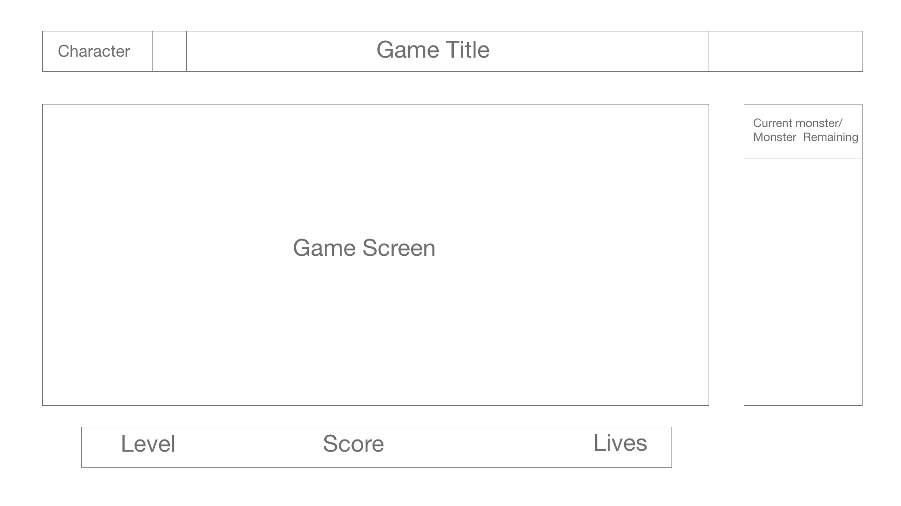
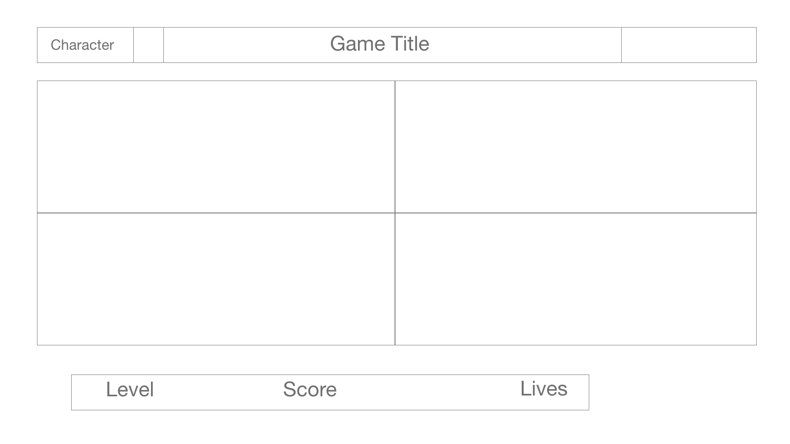

# game-proposal

 ### Dropper/Simon
- Dropper: Several bad guys fall from the top of the screen, and the user must avoid them. The player can be controlled with the arrow keys or more directly with the mouse. The longer the player lasts without being hit, the higher the score.

- Simon: Description: Four colored buttons light up in a specific pattern. After displaying the pattern, the player must repeat the pattern by clicking the buttons in proper order. The pattern gets longer each time the player completes the pattern. If the player presses a wrong button, the game ends.

### Rules of the game
- Dropper:
  - Players press the arrows dodge allow monsters attack.
  - players can retreat to return to base and purchase upgrades for their character before the next battle 

- Simon:
  - Players press the  the four squares according to the given sequence.
  - players can earn points to get sequence replays in case they missed the sequence

### Technical Challenges (Dropper)
- canvas
- Ships moving while player moves 
- Grid w/Canvas

### Technical Challenges (Simon)
- Grid
- keyframes

### Wireframe
Dropper/Simon start page:

Dropper wireframe:

Simon Wireframe:

### Timeline

- Tuesday

  - Finish code functionality today, currently from last project code i have all the bonuses except the multiple ships can attack, mega-ship, and the ship upgrades.

 - Wednesday 
    - Troubleshoot all js functionality 
    - learn/work on canvas 
    
- Thursday:
   - Canvas

Friday:
- Canvas/CSS

Saturday:
- Canvas/CSS

Sunday:
- Canvas/CSS

