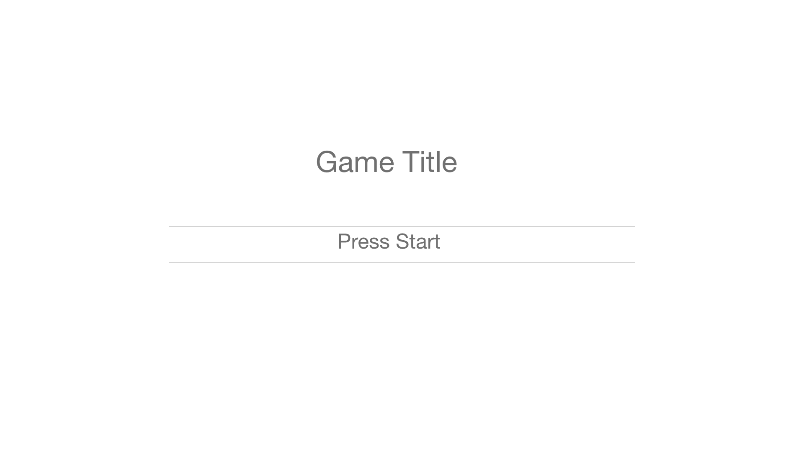
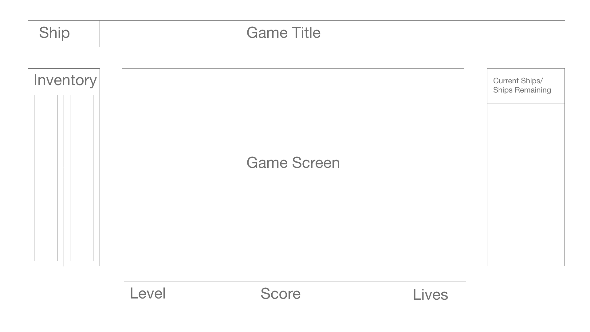

# game-proposal

 ### Galaga 
- Basically a galaga derivative that allows the players to fight ships that spawn. The player will earn points as he destroys ships and can upgrade his ship over time. After completion of the base game players can either play again, quit, or activate and endless mode where the alien ships will get harder but the player will earn more points and try to kill as many ships as he can to get the high score

### Rules of the game
- Players press the arrows dog and hopefully will allow players and ships to attack each other at the same time.

- players can retreat to return to base and purchase upgrades for their ship before the next battle 

### Technical Challenges
- canvas
- Ships moving while player moves 
- Grid w/Canvas

### Wireframe

### Timeline

- Tuesday

  - Finish code functionality today, currently from last project code i have all the bonuses except the multiple ships can attack, mega-ship, and the ship upgrades.

 - Wednesday 
    - Troubleshoot all js functionality 
    - learn/work on canvas 
    
- Thursday:
   - Canvas

Friday:
- Canvas/CSS

Saturday:
- Canvas/CSS

Sunday:
- Canvas/CSS

